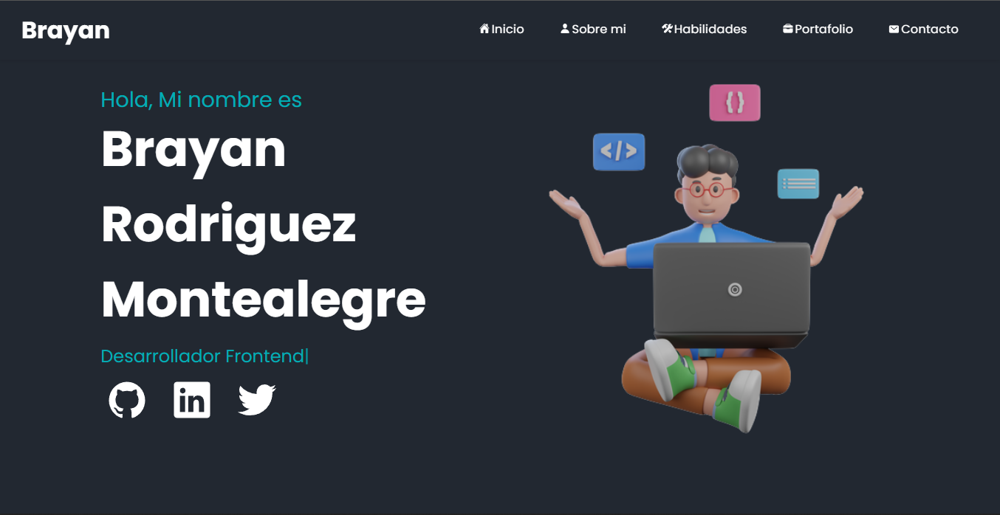

# Portfolio
My personal website.

## Screenshot


## Technologies 🛠️
* Next.js
* Styled Componets
* Vercel
* Git

## Installation
Clone project 
```
  git clone https://github.com/Brayanro/Portfolio.git
```

Install dependencies
```
  yarn install or npm install
```

Run proyect in development
```
  yarn dev or npm run dev
```